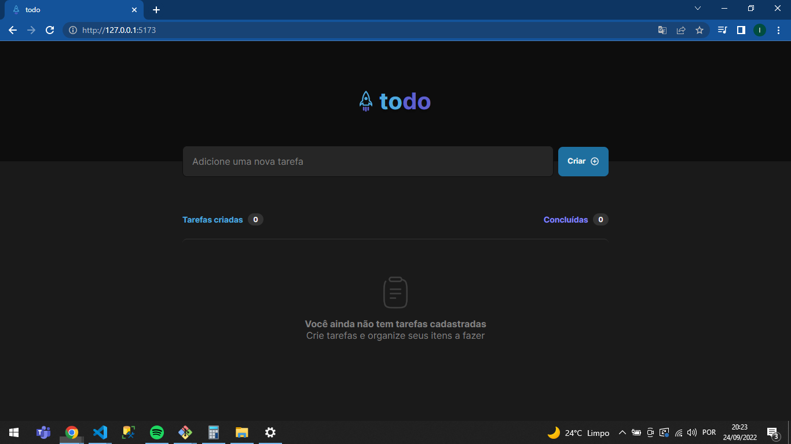
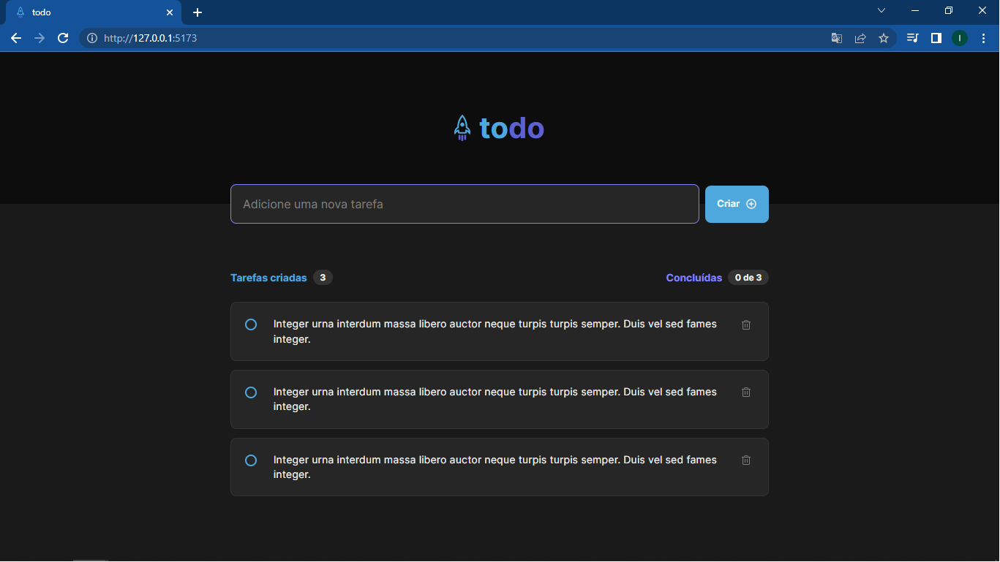
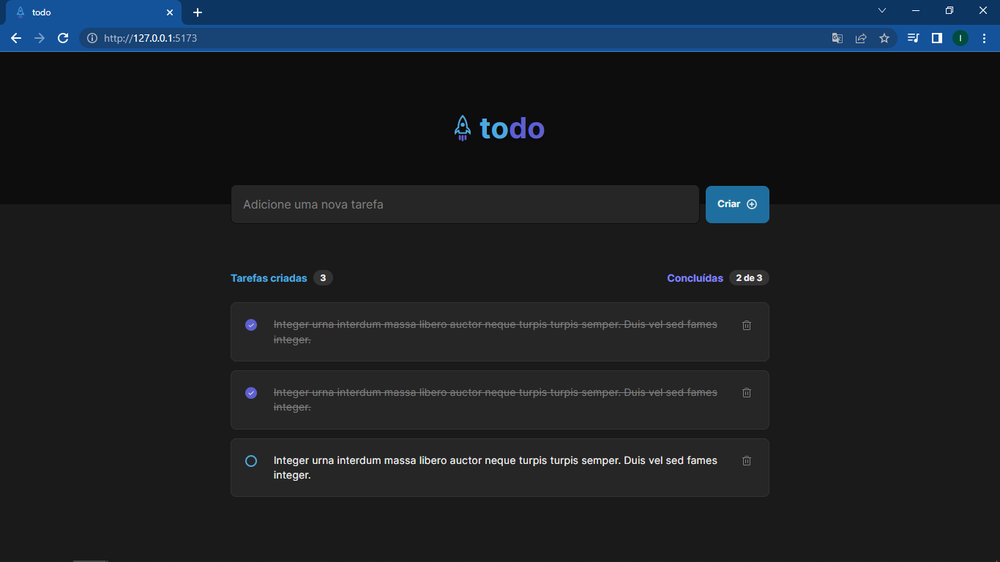
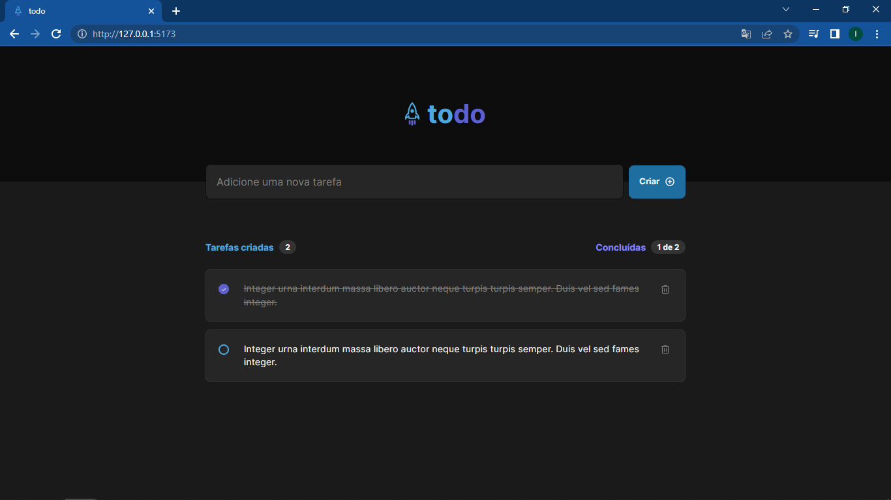

<h1 align="center"> Desafio 01 - Praticando os conceitos do ReactJS
</h1>

<p align="center">
 <a href="#-sobre-o-desafio">Sobre</a> •
 <a href="#-layout">Layout</a> • 
 <a href="#-como-executar-o-projeto">Como executar</a> • 
 <a href="#-tecnologias">Tecnologias</a> • 
 <a href="#-autor">Autor</a> • 
</p>

## 💻 Sobre o desafio

Nesse desafio, desenvolvi uma aplicação de controle de tarefas no estilo **to-do list**, que contém as seguintes funcionalidades:

- Adicionar uma nova tarefa
- Marcar e desmarcar uma tarefa como concluída
- Remover uma tarefa da listagem
- Mostrar o progresso de conclusão das tarefas

Apesar de serem poucas funcionalidades, utilizei alguns conceitos importantes como:

- Estados
- Imutabilidade do estado
- Listas e chaves no ReactJS
- Propriedades
- Componentização

---

## 🎨 Layout

### Telas do todo

<p align="center" style="display: flex; align-items: flex-start; justify-content: center;">
  
</p>

<p align="center" style="display: flex; align-items: flex-start; justify-content: center;">
  
</p>

<p align="center" style="display: flex; align-items: flex-start; justify-content: center;">
  
</p>

<p align="center" style="display: flex; align-items: flex-start; justify-content: center;">
  
</p>

---

## 🚀 Como executar o projeto

Este projeto possui uma pasta:

1. desafio01-todolist

### Pré-requisitos

Antes de começar, você vai precisar ter instalado em sua máquina as seguintes ferramentas:
[Git](https://git-scm.com), [Node.js](https://nodejs.org/en/).
Além disto é bom ter um editor para trabalhar com o código como [VSCode](https://code.visualstudio.com/) e também o GitHubDesktop (https://desktop.github.com/)

### 🧭 Rodando a aplicação web

```bash

# Clone este repositório
$ git clone github.com/IranildoFs/desafio01-todolist.git

# Acesse a pasta do projeto no seu terminal/cmd
$ cd desafio01-todolist

# Instale as dependências
$ npm i

# Execute a aplicação em modo de desenvolvimento
$ npm run dev

# Acesse o link do terminal

```

---

## 🛠 Tecnologias

As seguintes bibliotecas/linguagens foram usadas na construção do projeto:

- **[React]**
- **[TypeScript]**

## 💪 Como contribuir para o projeto

1. Faça um **fork** do projeto.
2. Crie uma nova branch com as suas alterações: `git checkout -b my-feature`
3. Salve as alterações e crie uma mensagem de commit contando o que você fez: `git commit -m "feature: My new feature"`
4. Envie as suas alterações: `git push origin my-feature`
   > Caso tenha alguma dúvida confira este [guia de como contribuir no GitHub](./CONTRIBUTING.md)

---

## 🦸 Autor

Iranildo Fialho da Silva
